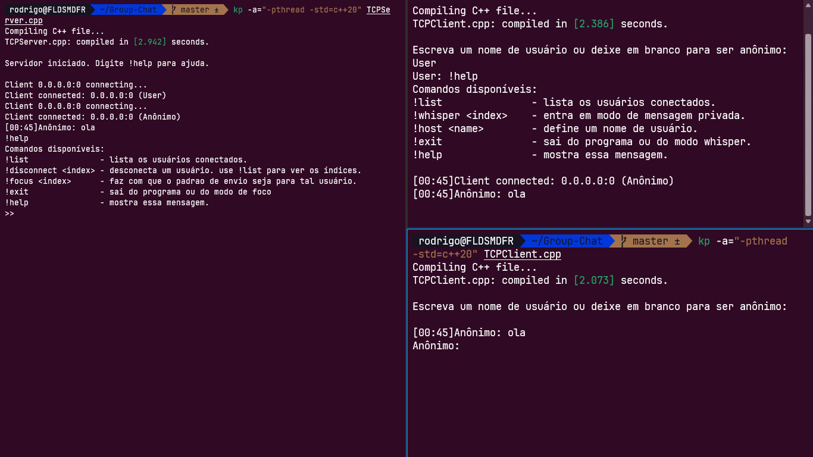

# Group Chat in C++

<!-- toc -->

- [Sobre](#sobre)
- [Compilando](#compilando)
  - [Linux](#linux)
  - [Windows](#windows)
- [Mídia](#mídia)

<!-- toc -->

## Sobre

É um projeto de um chat em grupo desenvolvido em C++ para a disciplina de Sistemas Distribuídos. Você pode checar o projeto na pasta da disciplina [aqui](https://github.com/Rodriggrr/UFC/tree/main/2023.2/sd/lista_1)

Agora é multiplataforma, você pode usar no Windows ou no Linux!

### Compilando

Para compilar, você necessita ter instalado o `g++11` |  **[INSTALAR](https://github.com/senapk/fupisfun/blob/master/wiki/configure_cpp.md#configurando-o-compilador-gcc-g)**

### Linux

```bash
g++ -std=c++20 -pthread <cliente ou server> -o out.a
./out.a
```

### Windows

```bash
g++ -std=c++20 <cliente ou servidor> -o out.exe
./out.exe
```

## Mídia


